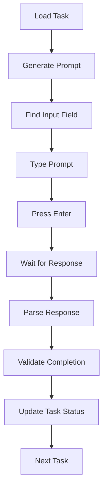

# 🤖 Cursor Automation CDP Task Automation System

## 🎯 Overview

This system automates Cursor Automation CDP development tasks by **directly controlling Cursor IDE** through **Chrome DevTools Protocol (CDP)** using Playwright. No APIs needed!

### 🚀 Key Features
- **Direct Cursor IDE Control**: Uses CDP to control Cursor IDE like a human
- **No API Keys Required**: Works with any Cursor IDE session
- **Real-time Interaction**: Types prompts and reads responses in real-time
- **Automatic Task Execution**: Goes through all 27 tasks systematically
- **Progress Tracking**: Updates task status automatically
- **Multi-Instance Support**: Run multiple Cursor instances on different ports

## 🔧 Setup

### 1. Install Dependencies

```bash
# Install Playwright
npm install playwright

# Make scripts executable
chmod +x run-automation-cdp.sh automation-workflow-cdp.js
chmod +x automation/ide/start_ide_example.sh
```

### 2. Download Cursor IDE

**Linux:**
```bash
# Download Cursor AppImage
wget https://download.cursor.sh/linux/appImage/x64 -O Cursor-1.2.2-x86_64.AppImage
chmod +x Cursor-1.2.2-x86_64.AppImage
```

**Windows:**
```bash
# Download Cursor .exe from https://cursor.sh
# Place Cursor.exe in your project directory
```

**macOS:**
```bash
# Download Cursor .dmg from https://cursor.sh
# Install and use the installed version
```

### 3. Configure IDE Paths

Edit the IDE start scripts to point to your Cursor installation:

**Linux (`automation/ide/start_ide_example.sh`):**
```bash
declare -A IDES=(
  ["cursor"]="./Cursor-1.2.2-x86_64.AppImage"  # Update path here
  ["vscode"]="code"
)
```

**Windows (`automation/ide/start_ide_example.ps1`):**
```powershell
$IDES = @{
    "cursor" = ".\Cursor.exe"  # Update path here
    "vscode" = "code"
}
```

**Windows Batch (`automation/ide/start_ide_example.bat`):**
```batch
set "CURSOR_PATH=.\Cursor.exe"  # Update path here
```

### 4. Start Cursor IDE with CDP

```bash
# Linux/macOS
./automation/ide/start_ide_example.sh cursor auto

# Windows PowerShell
.\automation\ide\start_ide_example.ps1 cursor auto

# Windows Batch
automation\ide\start_ide_example.bat cursor auto
```

### 5. Verify CDP Connection

```bash
# Check if Cursor is running with CDP (replace PORT with actual port)
curl http://localhost:9222/json/version
```

## 🎮 Usage

### Basic Commands

```bash
# Run with Cursor (default)
./run-automation-cdp.sh

# Use different CDP port
./run-automation-cdp.sh -p 9224

# Start from specific task
./run-automation-cdp.sh --task-id=5
```

### IDE Management Commands

```bash
# Start Cursor with automatic port selection
./automation/ide/start_ide_example.sh cursor auto

# Start Cursor on specific port slot
./automation/ide/start_ide_example.sh cursor 3

# Interactive menu
./automation/ide/start_ide_example.sh menu

# Show help
./automation/ide/start_ide_example.sh help
```

### Information Commands

```bash
# List all tasks
./run-automation-cdp.sh --list-tasks

# Show current status
./run-automation-cdp.sh --status

# Get Cursor setup help
./run-automation-cdp.sh --setup-cursor
```

### Utility Commands

```bash
# Reset all task statuses
./run-automation-cdp.sh --reset

# Dry run (see what would happen)
./run-automation-cdp.sh --dry-run

# Verbose output
./run-automation-cdp.sh --verbose
```

## 🔍 How It Works

### 1. CDP Connection
```javascript
// Connect to existing Cursor IDE instance
const browser = await chromium.connectOverCDP(`http://localhost:9222`);
const page = browser.pages()[0]; // Use existing page
```

### 2. Cursor IDE Detection
The system automatically detects and works with:

**Cursor IDE:**
- CDP URL: `http://localhost:9222` (Cursor CDP debugging port)
- Input selector: `[data-testid="chat-input"], textarea, input[type="text"]`
- Send key: `Enter`

### 3. Task Execution Flow



### 4. AI Communication

The system sends structured prompts like:

```
# Cursor Automation CDP Task Execution

## Task Information
- ID: 1
- Name: Core Game Engine Foundation
- Category: game-engine
- Estimated Time: 10h

## Instructions
Please execute this task completely by:
1. Analyzing the current codebase
2. Implementing all required functionality
3. Creating/modifying all necessary files
4. Adding comprehensive tests
5. Updating documentation

## Response Format
```json
{
  "status": "completed",
  "files_created": ["file1.js", "file2.js"],
  "files_modified": ["existing.js"],
  "tests_added": ["test1.test.js"],
  "validation_passed": true
}
```
```

## 📊 Task Categories & Automation Levels

### Full Auto Tasks (AI can handle completely)
- **Game Engine** (4 tasks): Core systems, character movement, combat
- **Frontend** (3 tasks): UI components, responsive design, controls
- **Data** (1 task): Statistics, leaderboards, tracking
- **Features** (3 tasks): Replay, spectator mode, social features
- **RPG Systems** (8 tasks): Inventory, NPCs, quests, skills

### Partial Auto Tasks (AI + human review)
- **Game Design** (2 tasks): Creative decisions need human input
- **Assets** (3 tasks): Visual/audio assets need human creation
- **Deployment** (1 task): Production deployment needs oversight

## 🔧 Configuration

### Environment Variables
```bash
# Optional: Set custom CDP port
export CDP_PORT=9222

# Optional: Set Cursor IDE path
export CURSOR_PATH="./Cursor-1.2.2-x86_64.AppImage"
```

### Configuration File
`automation-cdp-config.json`:
```json
{
  "cdp": {
    "port": 9222,
    "target": "cursor",
    "timeout": 30000
  },
  "automation": {
    "delay_between_tasks": 3000,
    "max_retries": 3,
    "response_timeout": 300000
  },
  "targets": {
    "cursor": {
      "url": "http://localhost:9222",
      "input_selector": "[data-testid=\"chat-input\"], textarea, input[type=\"text\"]",
      "send_key": "Enter"
    }
  }
}
```

## 📁 File Structure

```
Cursor Automation CDP/
├── automation-workflow-cdp.js      # Main CDP automation script
├── run-automation-cdp.sh           # CDP shell wrapper
├── automation-cdp-config.json      # CDP configuration
├── automation-workflow-cdp.log     # CDP execution logs
├── automation-cdp-report-YYYY-MM-DD.md # Daily reports
├── automation/
│   └── ide/
│       ├── start_ide_example.sh    # Linux/macOS IDE starter
│       ├── start_ide_example.ps1   # Windows PowerShell IDE starter
│       └── start_ide_example.bat   # Windows Batch IDE starter
└── docs/09_roadmap/tasks/
    └── system/
        ├── orchestrator.md         # Task definitions
        └── progress-tracker.md     # Progress updates
```

## 🔍 Monitoring & Debugging

### Log Files
- **`automation-workflow-cdp.log`**: Detailed CDP execution logs
- **`automation-cdp-report-YYYY-MM-DD.md`**: Daily execution reports
- **`docs/09_roadmap/tasks/system/progress-tracker.md`**: Live progress updates

### Debug Mode
```bash
# Enable verbose logging
./run-automation-cdp.sh --verbose

# Check logs in real-time
tail -f automation-workflow-cdp.log

# Test CDP connection
curl http://localhost:9222/json/version
```

## 🛠️ Troubleshooting

### Common Issues

**CDP Connection Failed**
```bash
# Check if Cursor is running with CDP
curl http://localhost:9222/json/version

# Restart Cursor with CDP
./automation/ide/start_ide_example.sh cursor auto
```

**Cursor Not Found**
```bash
# Check if Cursor is in the right location
ls -la Cursor-1.2.2-x86_64.AppImage

# Update path in start script
nano automation/ide/start_ide_example.sh
```

**Response Timeout**
```bash
# Increase timeout in config
# Check if AI is responding in Cursor
# Verify internet connection
```

### Debug Steps

1. **Check CDP Connection**
   ```bash
   curl http://localhost:9222/json/version
   ```

2. **Verify Cursor IDE**
   - Make sure Cursor is fully loaded
   - Check if chat interface is available

3. **Test Manual Interaction**
   - Try typing in the chat input manually
   - Verify the input selector works

4. **Check Logs**
   ```bash
   tail -f automation-workflow-cdp.log
   ```

## 🔄 Workflow Examples

### Complete Project Automation
```bash
# 1. Start Cursor with CDP
./automation/ide/start_ide_example.sh cursor auto

# 2. Wait for Cursor to fully load

# 3. Run automation
./run-automation-cdp.sh

# 4. Monitor progress
./run-automation-cdp.sh --status
```

### Incremental Development
```bash
# Start from specific task
./run-automation-cdp.sh --task-id=5

# Continue from where you left off
./run-automation-cdp.sh

# Check what's completed
./run-automation-cdp.sh --list-tasks
```

### Multiple Cursor Instances
```bash
# Start first Cursor instance
./automation/ide/start_ide_example.sh cursor 1

# Start second Cursor instance
./automation/ide/start_ide_example.sh cursor 2

# Run automation on specific port
./run-automation-cdp.sh -p 9222
```

## 📈 Expected Results

### Time Savings
- **Manual development**: 194 hours (8 weeks)
- **Cursor automation**: ~10-20 hours (3-5 days)
- **Time savings**: 90-95% reduction

### Quality Improvements
- Consistent AI interaction patterns
- Real-time response monitoring
- Automatic task progression
- Comprehensive logging

### Advantages over API
- **No API keys required**
- **Works with any Cursor IDE session**
- **Real-time visual feedback**
- **No rate limits**
- **More natural interaction**

## 🎉 Success Metrics

The system considers a task successful when:
- ✅ AI responds with proper JSON format
- ✅ `status` is "completed"
- ✅ `validation_passed` is `true`
- ✅ Files are listed as created/modified
- ✅ Tests are added
- ✅ Documentation is updated

## 🔮 Future Enhancements

- **Multi-Tab Support**: Handle multiple conversations
- **File Upload**: Automatically upload files to AI
- **Screenshot Analysis**: Analyze visual responses
- **Voice Integration**: Voice commands for control
- **Multi-IDE Support**: VSCode, IntelliJ, etc.
- **Parallel Execution**: Multiple tasks simultaneously

## 🚨 Important Notes

### Security
- CDP gives full browser control
- Only use with trusted applications
- Don't run with sensitive data open

### Reliability
- Internet connection required
- AI response quality varies
- Manual review recommended for critical tasks

### Performance
- Response times depend on AI service
- Large prompts may timeout
- Consider breaking complex tasks

---

**Happy Cursor IDE Automating! 🚀**

*This system transforms your development workflow by directly controlling Cursor IDE through the browser, eliminating the need for APIs and providing real-time interaction.* 