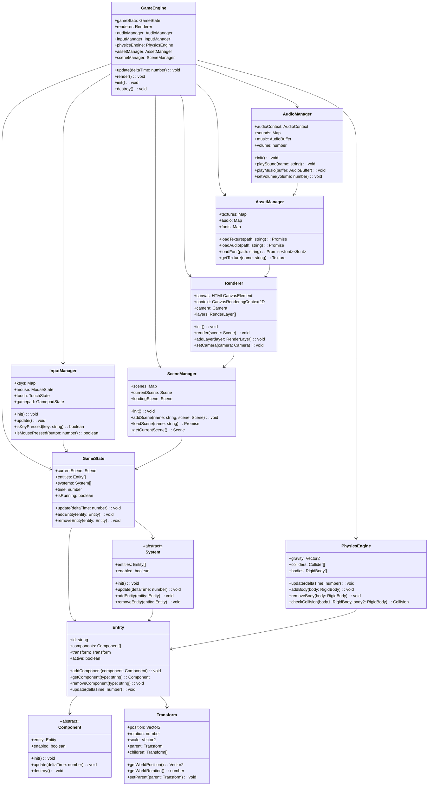
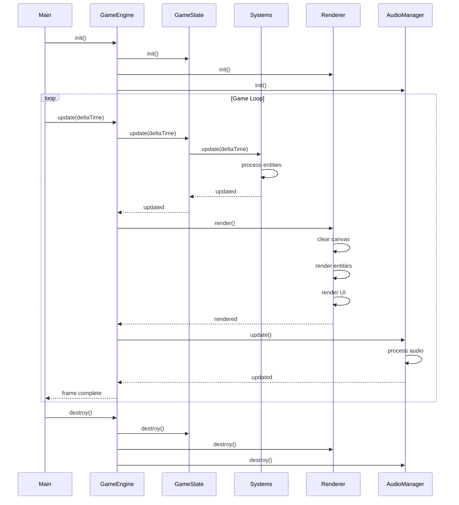
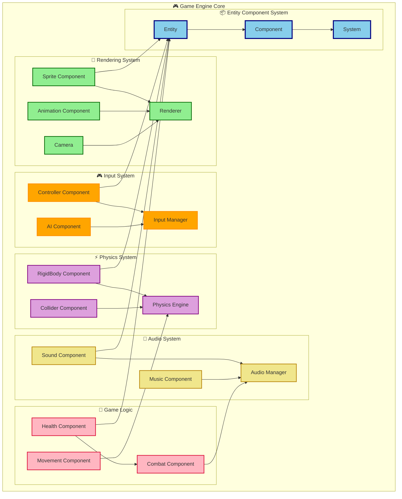
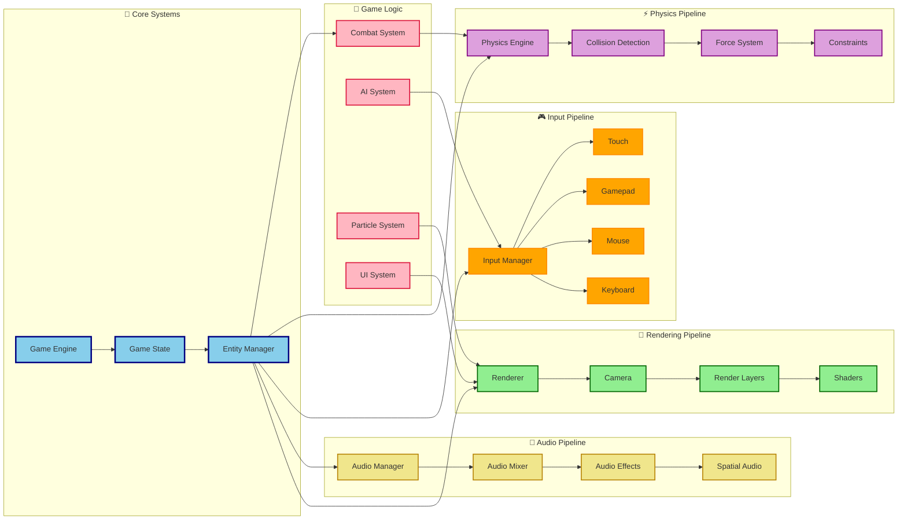

# Game Engine Core Architecture

## ⚙️ **Core Game Engine Structure**

## 🔄 **Game Loop Architecture**

## 🎯 **Component System Architecture**

## 🏗️ **System Dependencies**

---
*Erstellt: 2024-08-02*
*Diagramm-Typ: Game Engine Core Architecture* 