# Game Engine Core Architecture

## ⚙️ **Core Game Engine Structure**

## 🔄 **Game Loop Architecture**

## 🎯 **Component System Architecture**

## 🏗️ **System Dependencies**

```mermaid
graph LR
    subgraph "🎯 Core Systems"
        ENGINE[Game Engine]
        STATE[Game State]
        ENTITY[Entity Manager]
    end
    
    subgraph "🎨 Rendering Pipeline"
        RENDER[Renderer]
        CAMERA[Camera]
        LAYERS[Render Layers]
        SHADERS[Shaders]
    end
    
    subgraph "🎵 Audio Pipeline"
        AUDIO[Audio Manager]
        MIXER[Audio Mixer]
        EFFECTS[Audio Effects]
        SPATIAL[Spatial Audio]
    end
    
    subgraph "🎮 Input Pipeline"
        INPUT[Input Manager]
        KEYBOARD[Keyboard]
        MOUSE[Mouse]
        GAMEPAD[Gamepad]
        TOUCH[Touch]
    end
    
    subgraph "⚡ Physics Pipeline"
        PHYSICS[Physics Engine]
        COLLISION[Collision Detection]
        FORCES[Force System]
        CONSTRAINTS[Constraints]
    end
    
    subgraph "🎯 Game Logic"
        COMBAT[Combat System]
        AI[AI System]
        PARTICLE[Particle System]
        UI[UI System]
    end
    
    %% Core Dependencies
    ENGINE --> STATE
    STATE --> ENTITY
    
    %% Rendering Dependencies
    RENDER --> CAMERA
    CAMERA --> LAYERS
    LAYERS --> SHADERS
    
    %% Audio Dependencies
    AUDIO --> MIXER
    MIXER --> EFFECTS
    EFFECTS --> SPATIAL
    
    %% Input Dependencies
    INPUT --> KEYBOARD
    INPUT --> MOUSE
    INPUT --> GAMEPAD
    INPUT --> TOUCH
    
    %% Physics Dependencies
    PHYSICS --> COLLISION
    COLLISION --> FORCES
    FORCES --> CONSTRAINTS
    
    %% Game Logic Dependencies
    COMBAT --> PHYSICS
    AI --> INPUT
    PARTICLE --> RENDER
    UI --> RENDER
    
    %% Cross-system Dependencies
    ENTITY --> RENDER
    ENTITY --> AUDIO
    ENTITY --> INPUT
    ENTITY --> PHYSICS
    ENTITY --> COMBAT
    
    classDef core fill:#87CEEB,stroke:#000080,stroke-width:3px
    classDef rendering fill:#90EE90,stroke:#006400,stroke-width:2px
    classDef audio fill:#F0E68C,stroke:#B8860B,stroke-width:2px
    classDef input fill:#FFA500,stroke:#FF8C00,stroke-width:2px
    classDef physics fill:#DDA0DD,stroke:#800080,stroke-width:2px
    classDef logic fill:#FFB6C1,stroke:#DC143C,stroke-width:2px
    
    class ENGINE,STATE,ENTITY core
    class RENDER,CAMERA,LAYERS,SHADERS rendering
    class AUDIO,MIXER,EFFECTS,SPATIAL audio
    class INPUT,KEYBOARD,MOUSE,GAMEPAD,TOUCH input
    class PHYSICS,COLLISION,FORCES,CONSTRAINTS physics
    class COMBAT,AI,PARTICLE,UI logic
```

---
*Erstellt: 2024-08-02*
*Diagramm-Typ: Game Engine Core Architecture* 