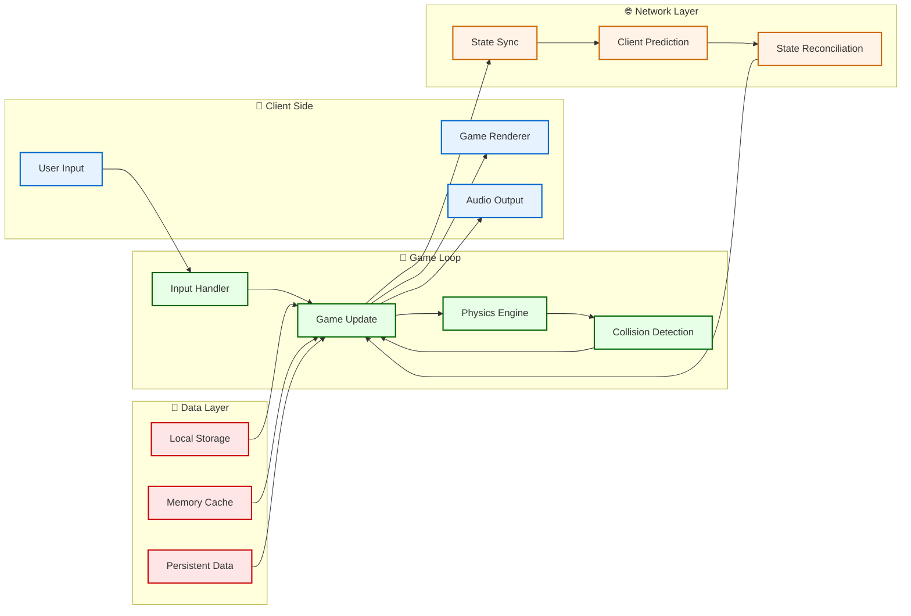
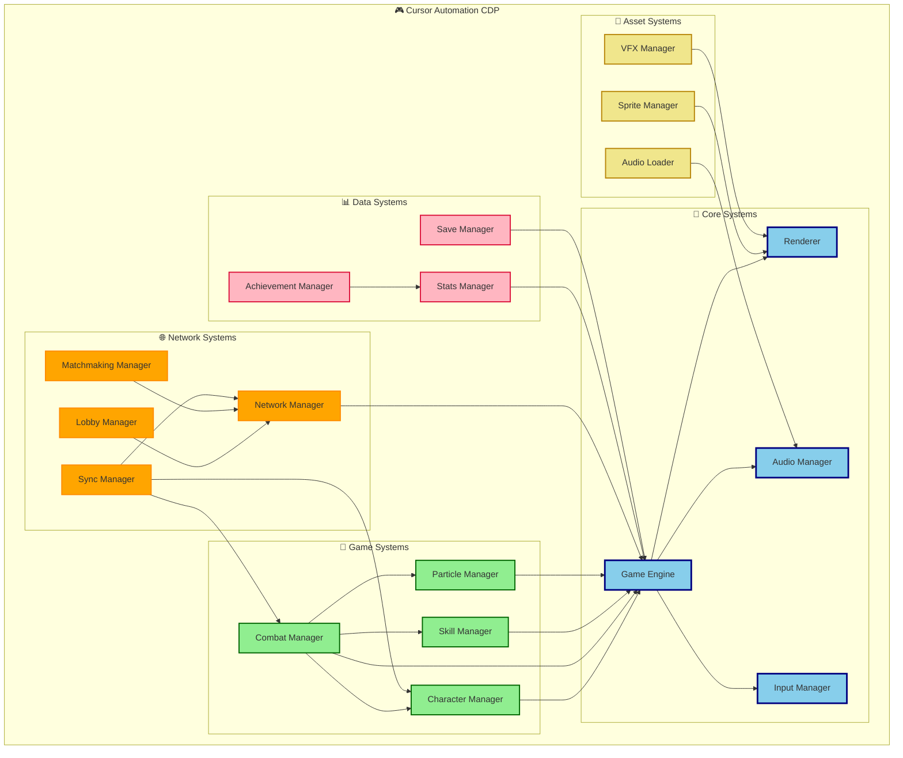

# Cursor Automation CDP System Architecture

## 🏗️ **Gesamtsystem-Architektur**

```mermaid
graph TB
    %% Main Application Layer
    subgraph "🎮 Cursor Automation CDP Application"
        subgraph "🖥️ Frontend Layer"
            UI[UI System & Controls]
            MOBILE[Mobile Optimization]
            SETTINGS[Settings & Customization]
        end
        
        subgraph "⚙️ Game Engine Layer"
            CORE[Core Game Engine]
            CHARACTER[Character System]
            COMBAT[Combat System]
            SKILLS[Skills & Abilities]
        end
        
        subgraph "🎨 Assets Layer"
            SPRITES[Sprites System]
            AUDIO[Audio System]
            VFX[Visual Effects]
        end
        
        subgraph "🌐 Multiplayer Layer"
            LOBBY[Lobby System]
            MATCHMAKING[Matchmaking]
            NETWORK[Network Sync]
        end
        
        subgraph "🎯 Game Features Layer"
            RPG[RPG Systems]
            TOURNAMENT[Tournament System]
            SOCIAL[Social Features]
        end
        
        subgraph "📊 Data Layer"
            STATS[Statistics]
            LEADERBOARDS[Leaderboards]
            REPLAY[Replay System]
        end
    end
    
    %% Backend Services
    subgraph "🔧 Backend Services"
        API[API Gateway]
        AUTH[Authentication]
        DB[(Database)]
        CACHE[(Cache)]
        STORAGE[File Storage]
    end
    
    %% External Services
    subgraph "🌍 External Services"
        CDN[CDN]
        ANALYTICS[Analytics]
        PUSH[Push Notifications]
    end
    
    %% Connections - Frontend to Game Engine
    UI --> CORE
    MOBILE --> CORE
    SETTINGS --> CORE
    
    %% Game Engine Internal
    CORE --> CHARACTER
    CORE --> COMBAT
    CORE --> SKILLS
    CHARACTER --> COMBAT
    SKILLS --> COMBAT
    
    %% Assets Integration
    SPRITES --> CHARACTER
    AUDIO --> COMBAT
    VFX --> COMBAT
    SPRITES --> UI
    
    %% Multiplayer Integration
    LOBBY --> NETWORK
    MATCHMAKING --> NETWORK
    NETWORK --> COMBAT
    NETWORK --> CHARACTER
    
    %% Game Features Integration
    RPG --> CHARACTER
    RPG --> SKILLS
    TOURNAMENT --> LOBBY
    SOCIAL --> LOBBY
    
    %% Data Integration
    STATS --> COMBAT
    LEADERBOARDS --> STATS
    REPLAY --> COMBAT
    
    %% Backend Connections
    API --> AUTH
    API --> DB
    API --> CACHE
    API --> STORAGE
    
    %% External Connections
    CDN --> STORAGE
    ANALYTICS --> STATS
    PUSH --> SOCIAL
    
    %% Frontend to Backend
    UI --> API
    LOBBY --> API
    STATS --> API
    
    %% Styling
    classDef frontend fill:#90EE90,stroke:#006400,stroke-width:2px
    classDef gameEngine fill:#87CEEB,stroke:#000080,stroke-width:2px
    classDef assets fill:#F0E68C,stroke:#B8860B,stroke-width:2px
    classDef multiplayer fill:#FFA500,stroke:#FF8C00,stroke-width:2px
    classDef features fill:#DDA0DD,stroke:#800080,stroke-width:2px
    classDef data fill:#FFB6C1,stroke:#DC143C,stroke-width:2px
    classDef backend fill:#D3D3D3,stroke:#696969,stroke-width:2px
    classDef external fill:#98FB98,stroke:#228B22,stroke-width:2px
    
    class UI,MOBILE,SETTINGS frontend
    class CORE,CHARACTER,COMBAT,SKILLS gameEngine
    class SPRITES,AUDIO,VFX assets
    class LOBBY,MATCHMAKING,NETWORK multiplayer
    class RPG,TOURNAMENT,SOCIAL features
    class STATS,LEADERBOARDS,REPLAY data
    class API,AUTH,DB,CACHE,STORAGE backend
    class CDN,ANALYTICS,PUSH external
```

## 🔄 **Datenfluss-Architektur**

## 🏛️ **Komponenten-Hierarchie**

---
*Erstellt: 2024-08-02*
*Diagramm-Typ: System Architecture* 