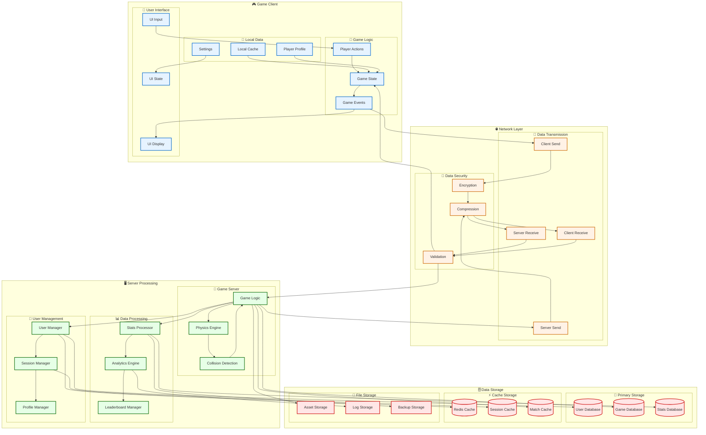
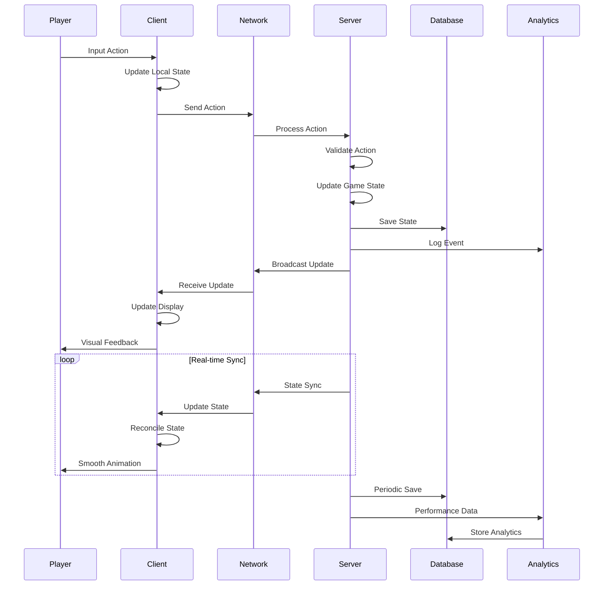
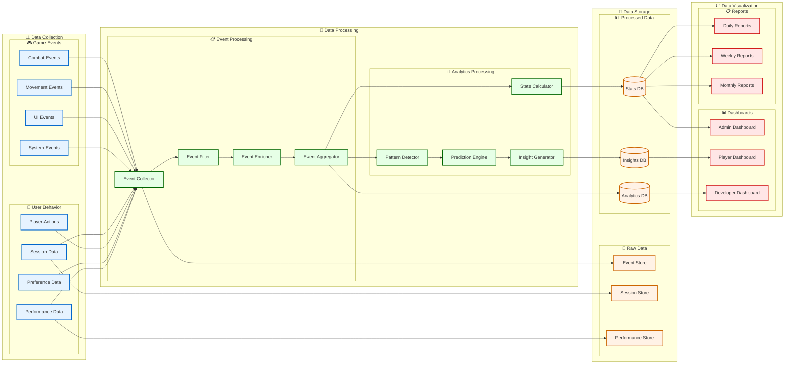
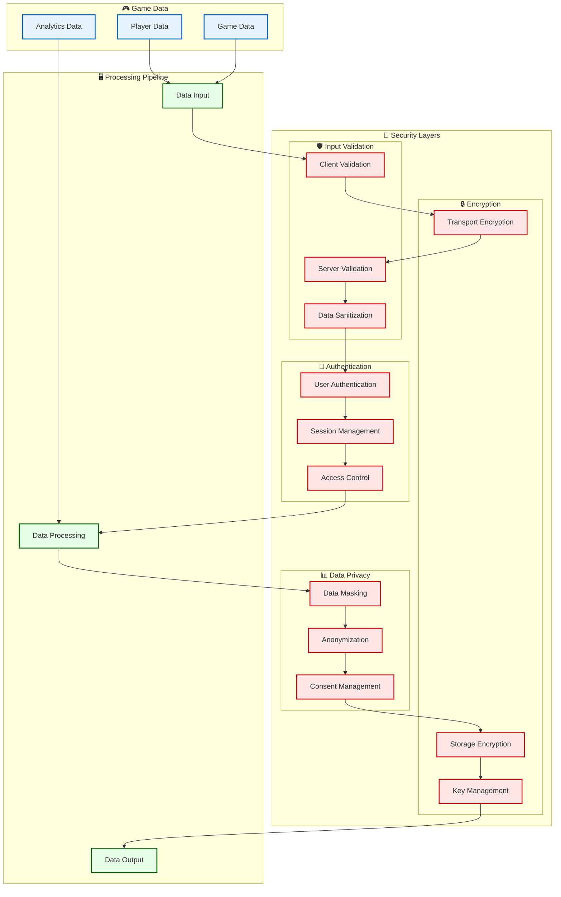
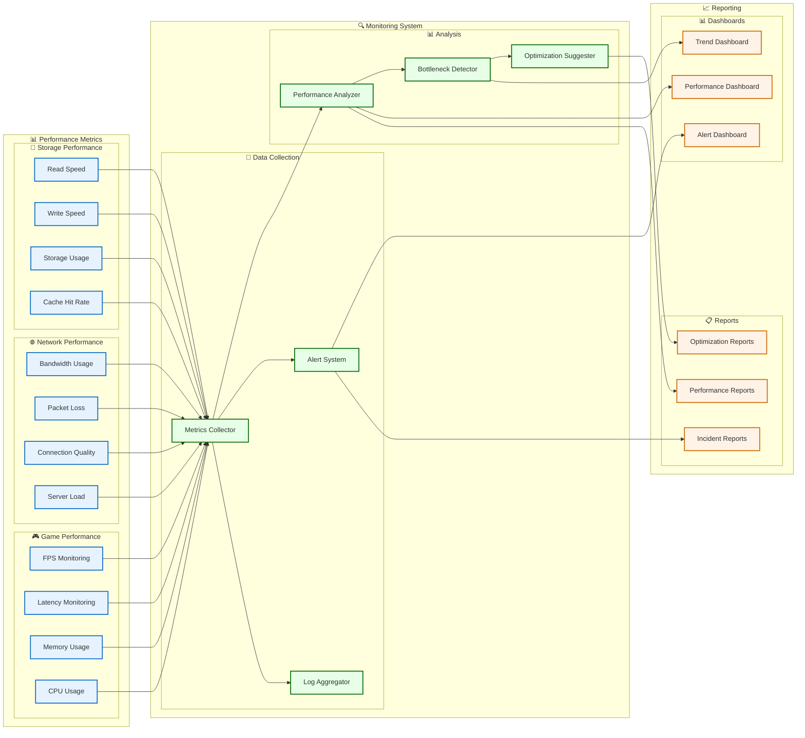

# Data Flow Architecture

## 📊 **Data Flow Overview**

## 🔄 **Real-time Data Flow**

## 📈 **Analytics Data Pipeline**

## 🔐 **Data Security Flow**

## 📊 **Performance Monitoring**

---
*Erstellt: 2024-08-02*
*Diagramm-Typ: Data Flow Architecture* 