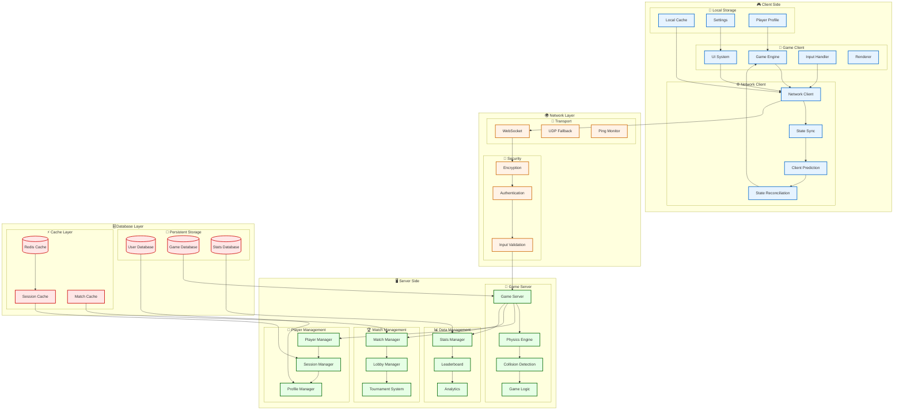
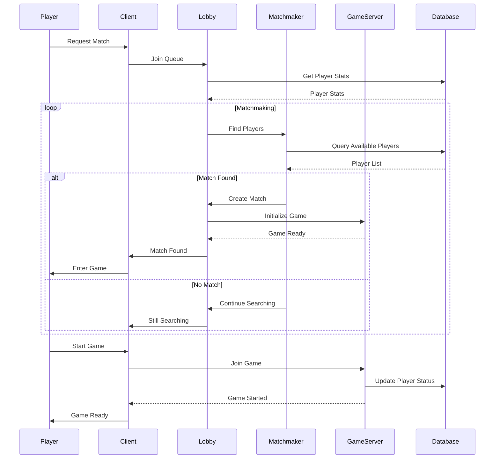
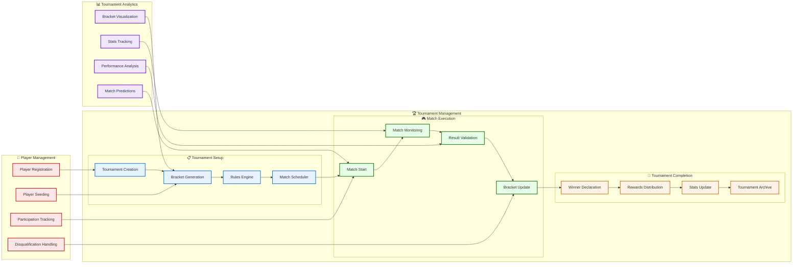
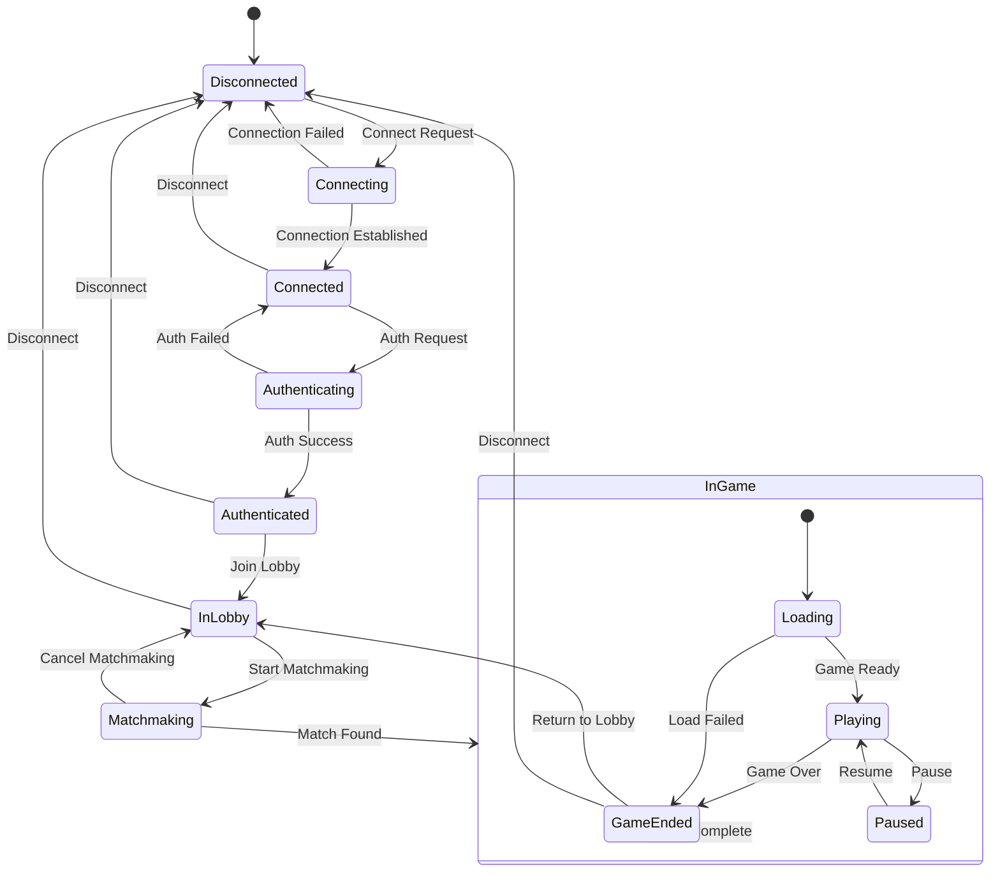
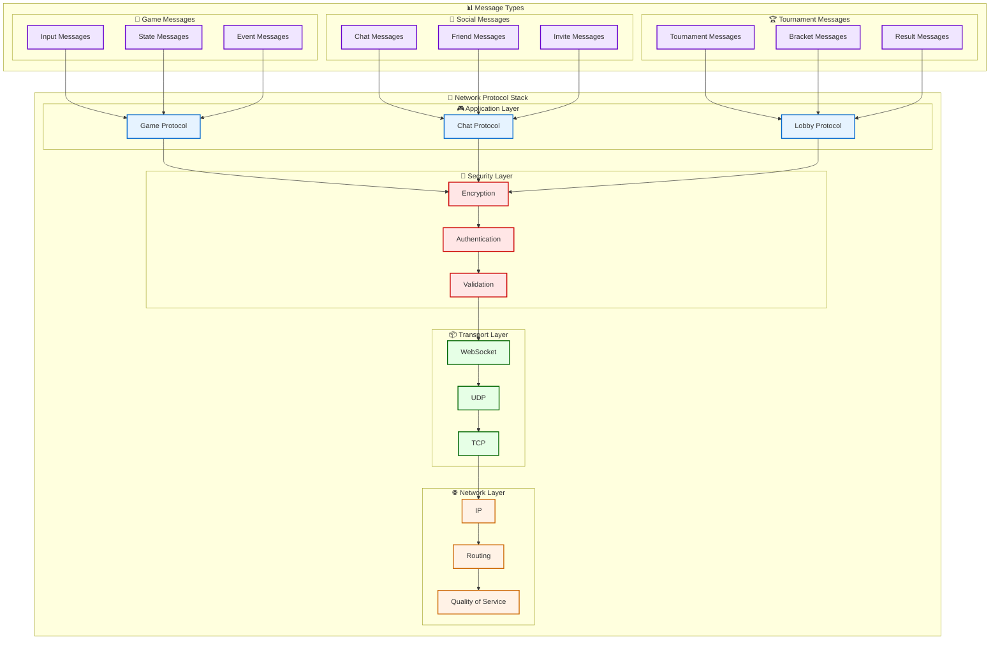

# Multiplayer Architecture

## 🌐 **Multiplayer System Overview**

## 🔄 **Matchmaking Flow**

## 🏆 **Tournament System**

## 🔄 **State Synchronization**

## 📊 **Network Protocol**

---
*Erstellt: 2024-08-02*
*Diagramm-Typ: Multiplayer Architecture* 