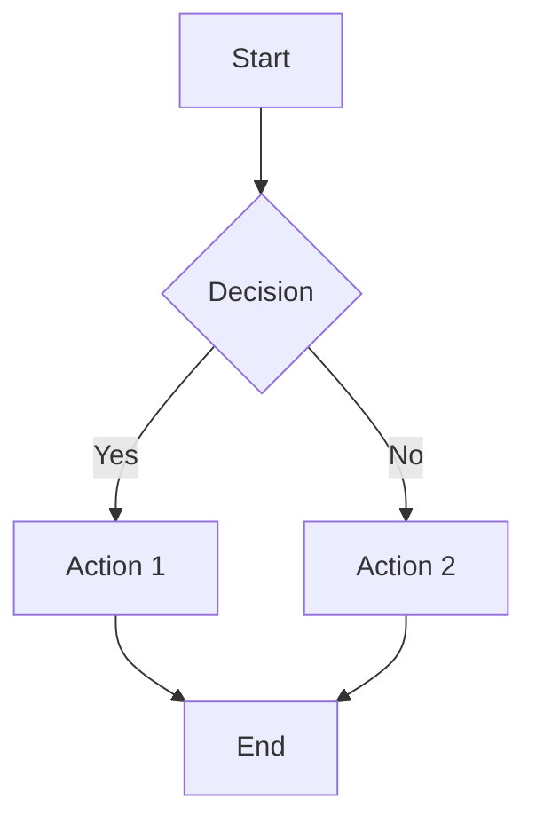

# Cursor Automation CDP Mermaid Diagramme

## 📊 **Diagramm-Übersicht**

### **1. Projekt-Struktur**
- [Architektur-Übersicht](architecture-overview.md) - Gesamtsystem-Architektur
- [Task-Management-Flow](task-management-flow.md) - Workflow der Task-Verwaltung
- [Entwicklungsphasen](development-phases.md) - Phasen und Abhängigkeiten

### **2. Game Engine**
- [Game Engine Core](game-engine-core.md) - Kernkomponenten der Game Engine
- [Character System](character-system.md) - Charakter-System und Abhängigkeiten
- [Combat System](combat-system.md) - Kampfsystem und Interaktionen
- [Skills & Abilities](skills-abilities.md) - Fähigkeiten-System

### **3. Frontend & UI**
- [UI System Architecture](ui-system-architecture.md) - UI-Komponenten und Struktur
- [Mobile Optimization](mobile-optimization.md) - Mobile Anpassungen
- [Settings & Customization](settings-customization.md) - Einstellungen-System

### **4. Multiplayer & Networking**
- [Multiplayer Architecture](multiplayer-architecture.md) - Multiplayer-System
- [Matchmaking Flow](matchmaking-flow.md) - Matchmaking-Prozess
- [Lobby System](lobby-system.md) - Lobby-Management

### **5. Game Features**
- [RPG Systems](rpg-systems.md) - RPG-Features und Systeme
- [Tournament System](tournament-system.md) - Turnier-System
- [Social Features](social-features.md) - Soziale Funktionen

### **6. Data & Analytics**
- [Data Flow](data-flow.md) - Datenfluss und -verarbeitung
- [Statistics System](statistics-system.md) - Statistiken und Leaderboards

## 🎯 **Verwendung**

### **Diagramm-Typen**
- **Flowcharts**: Prozesse und Workflows
- **Class Diagrams**: System-Architektur und Beziehungen
- **Sequence Diagrams**: Interaktionen zwischen Komponenten
- **State Diagrams**: Zustandsübergänge
- **Entity Relationship**: Datenbeziehungen

### **Farbkodierung**
- 🔵 **Blau**: Core Systems (Game Engine)
- 🟢 **Grün**: Frontend & UI
- 🟡 **Gelb**: Assets & Content
- 🟠 **Orange**: Multiplayer & Networking
- 🟣 **Lila**: Game Features & RPG
- 🔴 **Rot**: Data & Analytics
- ⚫ **Grau**: Infrastructure & Deployment

## 📝 **Diagramm-Erstellung Guidelines**

### **Best Practices**
1. **Konsistente Namensgebung**: Verwende die gleichen Namen wie in der Codebase
2. **Klare Hierarchie**: Zeige Abhängigkeiten und Beziehungen deutlich
3. **Farbkodierung**: Nutze die definierte Farbpalette
4. **Kommentare**: Füge Erklärungen für komplexe Beziehungen hinzu
5. **Modularität**: Teile große Diagramme in kleinere, fokussierte auf

### **Mermaid-Syntax**

---
*Erstellt: 2024-08-02*
*Letztes Update: 2024-08-02* 