# Task Management Flow

## 🔄 **Task-Workflow**

```mermaid
flowchart TD
    subgraph "📋 Task Creation"
        IDEA[New Idea/Requirement]
        ANALYSIS[Task Analysis]
        PRIORITY[Priority Assessment]
        CATEGORY[Category Assignment]
    end
    
    subgraph "📝 Task Planning"
        PHASE[Phase Planning]
        DEPENDENCIES[Dependency Mapping]
        ESTIMATE[Effort Estimation]
        ASSIGNMENT[Resource Assignment]
    end
    
    subgraph "🛠️ Task Execution"
        DEVELOPMENT[Development]
        TESTING[Testing]
        REVIEW[Code Review]
        INTEGRATION[Integration]
    end
    
    subgraph "✅ Task Completion"
        VALIDATION[Validation]
        DOCUMENTATION[Documentation]
        DEPLOYMENT[Deployment]
        MONITORING[Monitoring]
    end
    
    subgraph "🔄 Task Review"
        FEEDBACK[Feedback Collection]
        IMPROVEMENT[Process Improvement]
        LESSONS[Lessons Learned]
        UPDATE[System Update]
    end
    
    %% Task Creation Flow
    IDEA --> ANALYSIS
    ANALYSIS --> PRIORITY
    PRIORITY --> CATEGORY
    
    %% Task Planning Flow
    CATEGORY --> PHASE
    PHASE --> DEPENDENCIES
    DEPENDENCIES --> ESTIMATE
    ESTIMATE --> ASSIGNMENT
    
    %% Task Execution Flow
    ASSIGNMENT --> DEVELOPMENT
    DEVELOPMENT --> TESTING
    TESTING --> REVIEW
    REVIEW --> INTEGRATION
    
    %% Task Completion Flow
    INTEGRATION --> VALIDATION
    VALIDATION --> DOCUMENTATION
    DOCUMENTATION --> DEPLOYMENT
    DEPLOYMENT --> MONITORING
    
    %% Task Review Flow
    MONITORING --> FEEDBACK
    FEEDBACK --> IMPROVEMENT
    IMPROVEMENT --> LESSONS
    LESSONS --> UPDATE
    
    %% Feedback Loops
    UPDATE -.-> IDEA
    FEEDBACK -.-> DEVELOPMENT
    IMPROVEMENT -.-> PHASE
    
    classDef creation fill:#E6F3FF,stroke:#0066CC,stroke-width:2px
    classDef planning fill:#E6FFE6,stroke:#006600,stroke-width:2px
    classDef execution fill:#FFF2E6,stroke:#CC6600,stroke-width:2px
    classDef completion fill:#FFE6E6,stroke:#CC0000,stroke-width:2px
    classDef review fill:#F0E6FF,stroke:#6600CC,stroke-width:2px
    
    class IDEA,ANALYSIS,PRIORITY,CATEGORY creation
    class PHASE,DEPENDENCIES,ESTIMATE,ASSIGNMENT planning
    class DEVELOPMENT,TESTING,REVIEW,INTEGRATION execution
    class VALIDATION,DOCUMENTATION,DEPLOYMENT,MONITORING completion
    class FEEDBACK,IMPROVEMENT,LESSONS,UPDATE review
```

## 📊 **Task-Kategorien und Abhängigkeiten**

```mermaid
graph TB
    subgraph "🎯 Core Development"
        subgraph "01-Game-Engine"
            GE_CORE[Core Game Engine]
            GE_CHAR[Character System]
            GE_COMBAT[Combat System]
            GE_SKILLS[Skills & Abilities]
        end
        
        subgraph "02-Frontend"
            FE_UI[UI System]
            FE_MOBILE[Mobile Optimization]
            FE_SETTINGS[Settings & Customization]
        end
        
        subgraph "03-Assets"
            AS_SPRITES[Sprites System]
            AS_AUDIO[Audio System]
            AS_VFX[Visual Effects]
        end
    end
    
    subgraph "🌐 Advanced Features"
        subgraph "04-Multiplayer"
            MP_LOBBY[Lobby System]
            MP_MATCH[Matchmaking]
            MP_SYNC[Network Sync]
        end
        
        subgraph "05-Game-Design"
            GD_MODES[Game Modes]
            GD_LEVELS[Level Design]
            GD_PROGRESSION[Progression]
        end
        
        subgraph "06-Game-RPG"
            RPG_EQUIP[Equipment System]
            RPG_INVENTORY[Inventory System]
            RPG_QUESTS[Quest System]
            RPG_SKILLS[Skill Trees]
        end
    end
    
    subgraph "📈 Data & Analytics"
        subgraph "07-Data"
            DATA_STATS[Statistics]
            DATA_LEADER[Leaderboards]
            DATA_ANALYTICS[Analytics]
        end
        
        subgraph "08-Features"
            FEAT_REPLAY[Replay System]
            FEAT_TOURNAMENT[Tournament]
            FEAT_SPECTATOR[Spectator Mode]
        end
    end
    
    subgraph "🌍 Social & Deployment"
        subgraph "09-Social"
            SOCIAL_FRIENDS[Friends System]
            SOCIAL_CHAT[Chat System]
            SOCIAL_CLANS[Clan System]
        end
        
        subgraph "10-Deployment"
            DEP_POLISH[Polish]
            DEP_TESTING[Testing]
            DEP_RELEASE[Release]
        end
    end
    
    %% Core Dependencies
    GE_CORE --> GE_CHAR
    GE_CORE --> GE_COMBAT
    GE_CHAR --> GE_COMBAT
    GE_SKILLS --> GE_COMBAT
    
    %% Frontend Dependencies
    FE_UI --> GE_CORE
    FE_MOBILE --> FE_UI
    FE_SETTINGS --> FE_UI
    
    %% Asset Dependencies
    AS_SPRITES --> GE_CHAR
    AS_AUDIO --> GE_COMBAT
    AS_VFX --> GE_COMBAT
    
    %% Multiplayer Dependencies
    MP_LOBBY --> GE_CORE
    MP_MATCH --> MP_LOBBY
    MP_SYNC --> GE_COMBAT
    
    %% Game Design Dependencies
    GD_MODES --> GE_CORE
    GD_LEVELS --> AS_SPRITES
    GD_PROGRESSION --> RPG_SKILLS
    
    %% RPG Dependencies
    RPG_EQUIP --> GE_CHAR
    RPG_INVENTORY --> RPG_EQUIP
    RPG_QUESTS --> GD_LEVELS
    RPG_SKILLS --> GE_SKILLS
    
    %% Data Dependencies
    DATA_STATS --> GE_COMBAT
    DATA_LEADER --> DATA_STATS
    DATA_ANALYTICS --> DATA_STATS
    
    %% Feature Dependencies
    FEAT_REPLAY --> GE_COMBAT
    FEAT_TOURNAMENT --> MP_LOBBY
    FEAT_SPECTATOR --> MP_SYNC
    
    %% Social Dependencies
    SOCIAL_FRIENDS --> MP_LOBBY
    SOCIAL_CHAT --> SOCIAL_FRIENDS
    SOCIAL_CLANS --> SOCIAL_FRIENDS
    
    %% Deployment Dependencies
    DEP_POLISH --> FE_UI
    DEP_TESTING --> GE_CORE
    DEP_RELEASE --> DEP_TESTING
    
    classDef core fill:#87CEEB,stroke:#000080,stroke-width:3px
    classDef frontend fill:#90EE90,stroke:#006400,stroke-width:2px
    classDef assets fill:#F0E68C,stroke:#B8860B,stroke-width:2px
    classDef multiplayer fill:#FFA500,stroke:#FF8C00,stroke-width:2px
    classDef gameDesign fill:#DDA0DD,stroke:#800080,stroke-width:2px
    classDef rpg fill:#FFB6C1,stroke:#DC143C,stroke-width:2px
    classDef data fill:#E6E6FA,stroke:#4B0082,stroke-width:2px
    classDef features fill:#F5DEB3,stroke:#D2691E,stroke-width:2px
    classDef social fill:#98FB98,stroke:#228B22,stroke-width:2px
    classDef deployment fill:#D3D3D3,stroke:#696969,stroke-width:2px
    
    class GE_CORE,GE_CHAR,GE_COMBAT,GE_SKILLS core
    class FE_UI,FE_MOBILE,FE_SETTINGS frontend
    class AS_SPRITES,AS_AUDIO,AS_VFX assets
    class MP_LOBBY,MP_MATCH,MP_SYNC multiplayer
    class GD_MODES,GD_LEVELS,GD_PROGRESSION gameDesign
    class RPG_EQUIP,RPG_INVENTORY,RPG_QUESTS,RPG_SKILLS rpg
    class DATA_STATS,DATA_LEADER,DATA_ANALYTICS data
    class FEAT_REPLAY,FEAT_TOURNAMENT,FEAT_SPECTATOR features
    class SOCIAL_FRIENDS,SOCIAL_CHAT,SOCIAL_CLANS social
    class DEP_POLISH,DEP_TESTING,DEP_RELEASE deployment
```

## 🎯 **Entwicklungsphasen**

## 🔄 **Task-Status-Workflow**

---
*Erstellt: 2024-08-02*
*Diagramm-Typ: Task Management Flow* 